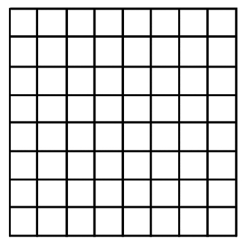
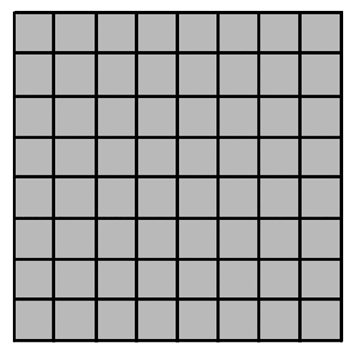
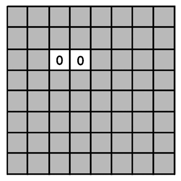
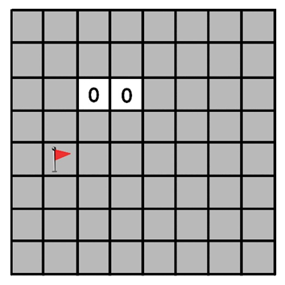
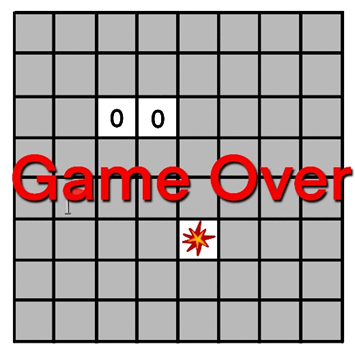
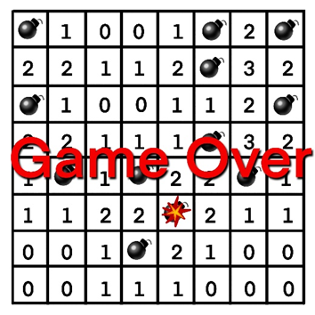
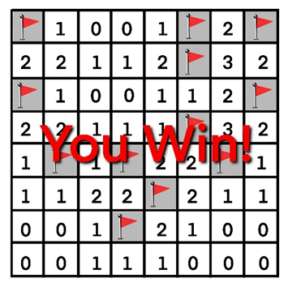
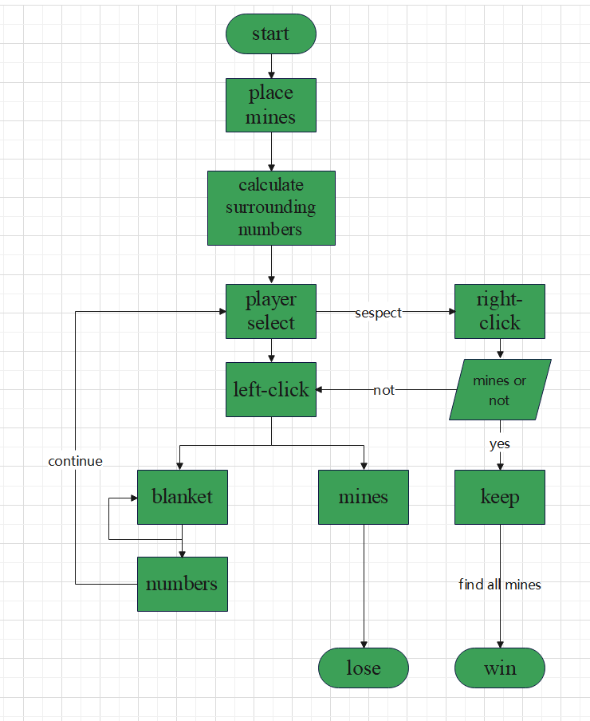

# Minesweeper: Problem analysis and specification

Group Members: 

Mengyao Zhang, Anting Zhu, lingjia Li, Nuan Leng, Xintong Du, Yuanxi Luo

<!-- vscode-markdown-toc -->
* 1. [Problem Analysis](#ProblemAnalysis)
	* 1.1. [User Description](#UserDescription)
	* 1.2. [Problem Description](#ProblemDescription)
	* 1.3. [Current User Solutions](#CurrentUserSolutions)
	* 1.4. [Problem Observations](#ProblemObservations)
	* 1.5. [How Can Computing and Software Help?](#HowCanComputingandSoftwareHelp)
* 2. [Requirements Analysis](#RequirementsAnalysis)
	* 2.1. [Requirements](#Requirements)
		* 2.1.1. [Functional Requirements](#FunctionalRequirements)
		* 2.1.2. [Non-Functional Requirements](#Non-FunctionalRequirements)
		* 2.1.3. [Optional Features](#OptionalFeatures)
	* 2.2. [Success Criteria](#SuccessCriteria)
* 3. [Prototype](#Prototype)
	* 3.1. [Sketches(Low-Fidelity Prototype)](#SketchesLow-FidelityPrototype)
	* 3.2. [Flow Chart(Conceptual Prototype)](#FlowChartConceptualPrototype)

<!-- vscode-markdown-toc-config
	numbering=true
	autoSave=true
	/vscode-markdown-toc-config -->
<!-- /vscode-markdown-toc -->

##  1. **Problem Analysis**

###  1.1. **User Description**

Elizabeth is a software engineering student who has a strong interest in programming and playing intellectually stimulating games.  And she eagerly seeks a game that helps her relax and stay refreshed during short mental breaks, for the demands of her studies often make her feel fatigued.

Since her free time is limited, Elizabeth is looking for a game that is both mentally engaging and easy to pick up and play in short sessions. She prefers games that demand no significant time commitment but involve some logical thinking.

###  1.2. **Problem Description**

Elizabeth has difficulty finding a game that meets her needs. The games on the market either demand too much time or are too simple to provide enough challenge she enjoys. She prefers games that require a bit logic but are not too complex, so she can start and have fun at any time she wants.

Elizabeth’s main requirements are as follows:
1. A game with simple rules, can be played in short sessions (3-5 minutes) and allow pausing.
2. Challenging enough to keep her engaged but not too demanding.
3. A game that runs smoothly on her laptop without heavy system requirements.

###  1.3. **Current User Solutions**
Currently, users often use their mobile phones for entertainment during breaks or rest periods, primarily engaging in activities such as browsing social media, watching short videos, or playing simple web-based mini-games (e.g., 2048, Sudoku). However, these solutions have the following issues:  

1. **Social media and short videos can be addictive**, affecting study efficiency and making it difficult to control gaming time effectively.  
2. **Web-based mini-games vary in quality**, with some containing excessive advertisements, leading to poor user experience. Additionally, many games require frequent online loading, reducing fluidity.  
3. **Many existing puzzle games become repetitive**, such as 2048, which has a single game mode that can quickly become monotonous. Sudoku, while offering a challenge, can sometimes be too mentally demanding for short relaxation periods.  
4. **Some games are time-dependent and do not support pausing and resuming progress**, meaning users often get interrupted by class sessions, social interactions, or other external factors, affecting their gaming experience.  

###  1.4. **Problem Observations**
- **User Preferences**: Users (especially students) prefer puzzle games that can stimulate their thinking but do not want them to be too mentally exhausting, as the primary goal is relaxation.  
- **Need for Fragmented Time Playability**: Since users primarily play games during short breaks, lunch hours, or while waiting, the game should have a moderate pace and allow pausing rather than requiring long continuous sessions.  
- **Limitations of Existing Games**:  
  - **Too Many Ads**: Many free mobile games rely on advertisements for revenue, frequently displaying pop-up ads that disrupt the experience, with some even inserting ads during gameplay, breaking immersion.  
  - **Slow Loading & Online Requirements**: Some web-based games require long loading times and a stable internet connection, which is inconvenient for users with limited data plans or unstable internet access.  
  - **Lack of Playability and Challenge**: Simple puzzle games like Sudoku and 2048 have fixed mechanics, which can become dull over time. Users want a game that offers a certain level of challenge but remains easy to pick up and play.  

###  1.5. **How Can Computing and Software Help?**

To address these issues, a lightweight, offline-compatible Minesweeper game can effectively meet user needs:  

1. **Clear Game Logic and Easy Implementation**:  
   - Minesweeper's core gameplay is based on logical deduction, requiring players to use known information to infer mine locations.  
   - Computers can automatically calculate cell statuses and provide immediate feedback, reducing the need for complex manual operations.  

2. **Offline Play Without Ads or Time Constraints**:  
   - A locally installed Minesweeper game can run entirely offline, eliminating loading times and ensuring a smooth user experience.  
   - No advertisements, allowing users to focus solely on the game without distractions.  
   - Users can pause and resume gameplay at any time, making it ideal for short gaming sessions without the risk of losing progress due to external interruptions.  

In short, existing games are either too time-consuming or too simplistic, often featuring excessive ads, online dependencies, and lack of pause functionality, making it difficult for users to find an engaging yet relaxing game suitable for short breaks.

##  2. **Requirements Analysis**

###  2.1. **Requirements**

####  2.1.1. **Functional Requirements**

1. **Core Game Mechanics**
   - Grid Layout: Grid size is 16×16.
   - Minefield Generation: Randomly distributes mines.
   - Number Hints: Non-mine cells display numbers indicating the count of adjacent mines.
   - Win/Loss Conditions:
     - The player wins if all mines are correctly flagged and all other cells are revealed.
     - The player loses upon clicking on a mine.

2. **User Interaction**
   - The interface should include:  
     - The game area.  
     - A "Restart" button to start a new game.  
   - Left-Click Actions:
     - Clicking an unrevealed cell reveals it, showing a number or triggering an auto-reveal if no adjacent mines exist.
     - Clicking a mine ends the game.

4. **Game Timer**  
   - The timer starts as soon as the player begins the game. A timestamp is recorded when the game is initialized.  
   - The timer updates every second, displaying the elapsed time in a readable format such as `mm:ss` or `hh:mm:ss`(when more than 1 hour).
   - When the game ends (either win or loss), the timer stops, and the final time is displayed on the game-over or victory screen.  

####  2.1.2. **Non-Functional Requirements**

1. **Clear and Intuitive Interface**  
   - The game window title should be "Minesweeper".  
   - The visual appearance should be clear:  
     - Unopened cells should be displayed in yellow.  
     - Mines should be displayed in red when the game ends.  

2. **Performance Considerations**  
   - The game can run on local devices without requiring an internet connection.  
   - The system should efficiently handle game state updates and ensure responsiveness in 0.01 second.  

####  2.1.3. **Optional Features**
- **Right-Click Actions**:
  - Right-clicking an unrevealed cell toggles between different markers (e.g., flag, question mark).
  - Quick Reveal: If a revealed number’s surrounding flagged mines equal its value, double-clicking automatically reveals the remaining adjacent cells.
- **Difficulty Levels**: Allow players to choose from different difficulty modes("Beginner, Intermediate, and Expert") by adjusting grid size(9×9, 16×16, 30×16) and the number of mines(10, 30, 50).  
- **Auto Save and Load**  
   - The game should periodically save the current state, including:  
     - The grid layout.  
     - Revealed cells.  
     - Flagged mines.  
     - Timer state (elapsed time).  
   - Upon reopening the game, the system should check for a saved game file. If one exists, it should prompt the player with the option to continue from the saved state or start a new game.  
   - The player should be notified if a saved game is available before deciding to load it.  
- **Performance Tracking**: Display player statistics, such as best completion time.  
- **First Click Safety**: Randomly distributes mines while ensuring the first click is safe.
- **Themes & Skins**: Offers different visual styles (e.g., classic, modern).
- **Sound Effects**: Includes click, flag placement, win, and loss sounds.

###  2.2. **Success Criteria**

A successful implementation of the game must meet the following criteria:  
1. **Core Gameplay Functionality**: The game executes essential actions with at least 99% accuracy in test cases, including revealing cells, displaying numbers, and processing win/loss conditions correctly.
2. **Randomized Mine Placement**: Mines are distributed randomly in each game. Maintain an even probability distribution across the grid.
3. **Restart Mechanism**: The "Restart" button fully resets the game by generating a new mine distribution, clearing all revealed and flagged cells, and restarting the timer.
4. **Win/Loss Determination**: The game registers a win only when all non-mine cells are revealed and a loss when a mine is clicked.
5. **User-Friendly Interface**: The interface follows standard Minesweeper conventions, featuring clear visual indicators, responsive controls, and accessibility options such as keyboard shortcuts and contrast settings.

##  3. **Prototype**
###  3.1. **Sketches(Low-Fidelity Prototype)**
This is a blank chess board, which is prepared for the game later on.

**Explanation**
- 💣 (Bomb): Represents a bomb location (usually hidden until a bomb is clicked or the game ends).
- 🚩 (Flag): Indicates that the player has marked this cell as containing a bomb (by right-clicking or long-pressing).
- Numbers: Show how many bombs are present in the eight surrounding cells.
- 0 (Zero): Represents an empty cell. When clicked, it will typically auto-expand to reveal adjacent empty cells.

Here is an example of gameplay situation:

| Text | Image |
|------|-------|
| **Step 1: Initial State (Unclicked)**
The left image is the initial display at the start of the game before any actions have been taken. |  |
| **Step 2: Player Clicks a Cell**
Player clicks on the cell C3, revealing the number of adjacent bombs. The number indicates how many bombs are present in the 8 surrounding cells. Since the number is “0”, it typically auto-expand to reveal adjacent empty cells. |  |
| **Step 3: Player Flags a Bomb (Right-Click Flagging)**
Right-click (or long press) to flag this cell E2 as a bomb. Players can flag multiple bombs, but they must flag correctly. |  |
| **Step 4: Player Clicks on a Bomb (Game Over)**
Player clicked F5 and hit a bomb, game over. |  |
| **After failure**
all bomb locations will be revealed. |  |
| **Game Victory**
If all safe cells have been clicked, and the remaining cells are correctly flagged as bombs, it will display “YOU WIN!” |  |

###  3.2. **Flow Chart(Conceptual Prototype)**
